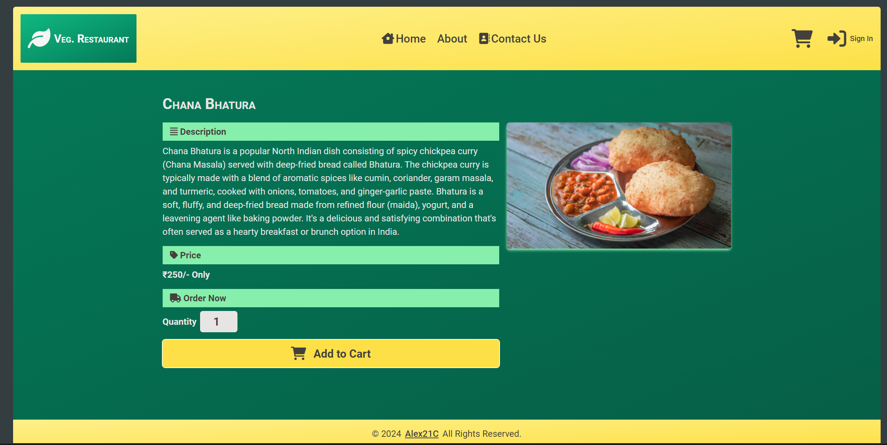

# Module#5 React MCT Project: Food Delivery WebApp


## Hosted Version of the Project:
[m5react-mct-project-food-delivery-webapp](https://m5react-mct-project-food-delivery-webapp.vercel.app/)

## Project Description
Veg. Restaurant is part of [Geekster](https://www.geekster.in/) MERN Stack Module #5 Project for Module Clearance Test conducted on 2nd Week of April 2024. Project was developed using ReactJs and TailwindCSS. Google Firebase was used for Authentication and Google Firestore Database was used for Storing Cart data.

Project featuring a Veg. Restaurant where customer can browse food items like North Indian, Chinese etc., place an order after sign in using email and password. The order will be received to the backend and Restaurant owner can process the order accordingly.

## How to install and run in yours local machine
```bash
npm install
npm run start
```

## Tech. Stack Used:
+ [React](https://react.dev/)
+ [TailwindCSS](https://tailwindcss.com/)
+ [Google Fonts](https://fonts.google.com/)
+ [Font Awesome](https://fontawesome.com/icons/)
+ [React Router Dom](https://reactrouter.com/en/main/start/tutorial) for providing routing functionality
+ [React Context API](https://react.dev/reference/react/useContext) for providing global state across application components
+ [Material UI Snack Bar](https://mui.com/material-ui/react-snackbar/) for providing notification to user when product added to cart
+ [Material UI Pagination](https://mui.com/material-ui/react-pagination/) for optimizing user bandwidth & resources utilization by loading only limited no of products and rest allowing user to load using pagination
+ [Google Firebase](console.firebase.google.com) for user Authentication, orders processing and storage

## Important 
You need to create an `.env` file in the root containing Firebase API Key and API ID.
Yours .env file should look like this
```
REACT_APP_FIREBASE_API_KEY= Yours firebase api key
REACT_APP_FIREBASE_API_ID= Yours firebase api ID
```
### How to get yours API Key & API ID
Now to get that API Key, you need to signup to [Google Firebase](console.firebase.google.com) and create new project and then crate new app,
while deploying yours app to [Vercel](https://vercel.com/) you need to specify these Enviornmnet variables inside settings.

### Why i did this?
to protect my API Key from aunthorized activity! 


## Credits
i express my gratitude towards [Geekster](https://www.geekster.in/) for providing me opportunity to become MERN Stack developer and achieve my vision board Financial Freedom Goal! Apart from Geekster i express my gratitude towards:
+ [Mohit kadwe](https://www.linkedin.com/in/mohit-kadwe/) Sir (Educator ReactJs)
+ [Ankit Singh](https://www.linkedin.com/in/asingh88029/) Sir (Educator Assistant)
+ Manan Bansal Sir (For checking Assignments, projects and providing feedback)
+ Success Managers: Palak Bhardwaj Mam, Yatharth Sharma Sir, Aanchal Parnami Mam, Avinash Prakash Sir
+ Geekster Curriculum Team: for designing cutting edge ReactJs Curriculum along with real life industry standard assignments as projects
+ Geekster Administrative Team: for timely starting classes, providing concept videos and study material!


## Author
[Abhishek kumar](https://www.linkedin.com/in/alex21c/), ([Geekster](https://geekster.in/) MERN Stack FS-14 Batch)


